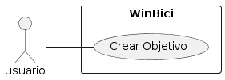

# CU002: Crear Objetivo

---

**Descripción:** Cuando un usuario desea agregar un nuevo objetivo en la plataforma WinBici, registra los detalles del objetivo.

**Actor:** Usuario


## Flujo de Eventos (Guión)


| Actor  | Sistema |
|:-------|:---------|
| 1. Ingresa los detalles del objetivo (nombre, descripción, vencimiento) | |
| | 2. Genera un ID único para el nuevo objetivo |
| | 3. Almacena el nuevo objetivo con su ID, nombre, descripción y vencimiento |
| | 4. Retorna un mensaje de confirmación de la creación del objetivo |


## Excepciones

2. Cuando ocurre un error en la creación del objetivo

| Actor  | Sistema |
|| 2.1. Muestra un mensaje "Error en la creación del objetivo" |
|| 2.2 Termina |


## Diagrama 



```plantuml
@startuml "crear_objetivo"
left to right direction
skinparam packageStyle rectangle

actor usuario
rectangle WinBici {
  usuario -- (Agregar/Crear Objetivo)
}

@enduml
