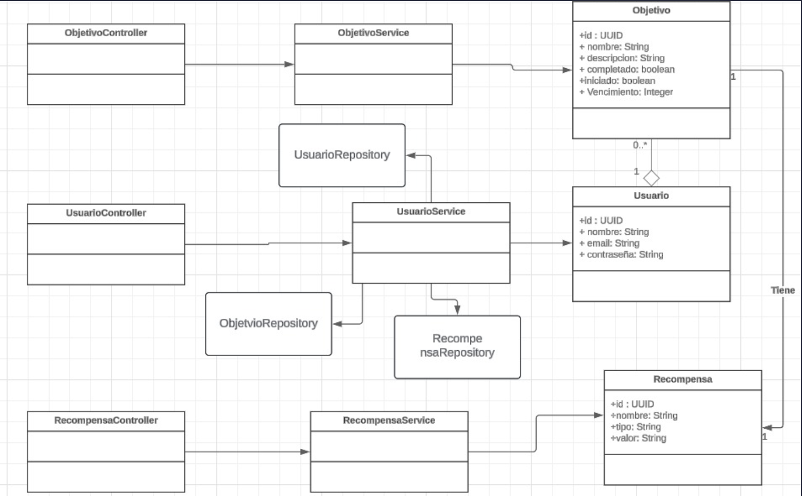
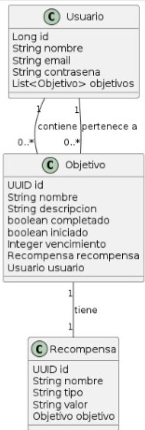

# 🟢 WinBici 🚲
### Elaborado por: Tatiana Vivas , Juan Pablo Cañón y Daniel Felipe León

## Indice:
- ### Descripción
- ### Diagrama de Clases
- ### Esquema Casos de Uso
- ### Casos de Uso

## Idea:
La propuesta de este proyecto es el lanzamiento de "WinBici", una plataforma digital que busca incentivar el uso de bicicletas ofreciendo recompensas y fomentando la participación en eventos y desafíos relacionados con el ciclismo. Este sistema está diseñado para enriquecer la experiencia ciclista, motivando tanto a propietarios como a quienes alquilan bicicletas a través de un enfoque gamificado que incluye logros, tareas diarias/semanales, y competiciones. "WinBici" se estructura en torno a tres módulos principales: Comunidad, Recompensas, y Tareas/Logros/Misiones, cada uno destinado a fomentar un mayor uso de bicicletas de manera divertida y comprometida, mientras se contribuye a la sostenibilidad y al bienestar personal.

## Diagrama de Clases:

## Esquema de Casos de Uso:

En el la siguiente imagen se encuentra el diagrama de los 5 casos de uso básicos para el funcionamiento de la parte inicial de WinBici

## Casos de Uso

# CU001: Registro de Usuario

---

**Descripción:** Cuando un nuevo usuario desea unirse a la plataforma WinBici, registra su nombre y su correo electrónico.

**Actor:** Usuario

## Flujo de Eventos (Guión)

| Actor  | Sistema |
|:-------|:---------|
| 1. Ingresa el nombre y el correo electrónico | |
| | 2. Verifica que el correo electrónico no este registrado previamente |
| | 3. Genera un ID único para el nuevo usuario |
| | 4. Almacena el nuevo usuario con su ID, nombre y correo electrónico |
| | 5. Retorna un mensaje de confirmación del registro |

## Excepciones

2. Cuando el correo electrónico ya está registrado

| Actor  | Sistema |
|:-------|:---------|
| | 2.1. Muestra un mensaje "El correo electrónico ya está registrado" |
| | 2.2. Termina | 

# CU002: Crear Objetivo

---

**Descripción:** Cuando un usuario desea crear un nuevo objetivo en la plataforma WinBici, registra el nombre del objetivo, la descripción y la fecha de vencimiento.

**Actor:** Usuario

## Flujo de Eventos (Guión)

| Actor  | Sistema |
|:-------|:---------|
| 1. Ingresa los detalles del objetivo (nombre, descripción, vencimiento) | |
| | 2. Genera un ID único para el nuevo objetivo |
| | 3. Almacena el nuevo objetivo con su ID, nombre, descripción y vencimiento |
| | 4. Retorna un mensaje de confirmación de la creación del objetivo |

## Excepciones

2. Cuando ocurre un error en la creación del objetivo

| Actor  | Sistema |
|| 2.1. Muestra un mensaje "Error en la creación del objetivo" |
|| 2.2 Termina |

# CU003: Mostrar recompensa

---

**Descripción:** Cuando un usuario desea visualizar las recompensas disponibles, accede a este caso de uso para poder consultarlos.

**Actor:** Usuario

## Flujo de Eventos (Guión)

| Actor  | Sistema |
|:-------|:---------|
| 1. Solicita ver las recompensas disponibles | |
| | 2. Recupera la lista de recompensas disponibles |
| | 3. Muestra la lista de recompensas al usuario |

## Excepciones

2. Cuando no hay recompensas disponibles.

| Actor  | Sistema |
|| 2.1. Muestra un mensaje "No hay recompensas disponibles"|
|| 2.2 Termina |

# CU004: Mostrar objetivos

---

**Descripción:** Cuando el usuario quiera ver los objetivos que ha ingresado, accede a la base y se mostrarán los resultados.

**Actor:** usuario

## Flujo de Eventos (Guión)

| Actor  | Sistema |
|:-------|:---------|
| 1. Solicita ver los objetivos cumplidos y por cumplir | |
| | 2. Recupera la lista de objetivos cumplidos y por cumplir del usuario |
| | 3. Muestra la lista de objetivos al usuario|

## Excepciones

2. Cuando no hay objetivos disponibles

| Actor  | Sistema |
|:-------|:---------|
| | 2.1. Muestra un mensaje "No hay objetivos disponibles" |
| | 2.2. Termina | 

