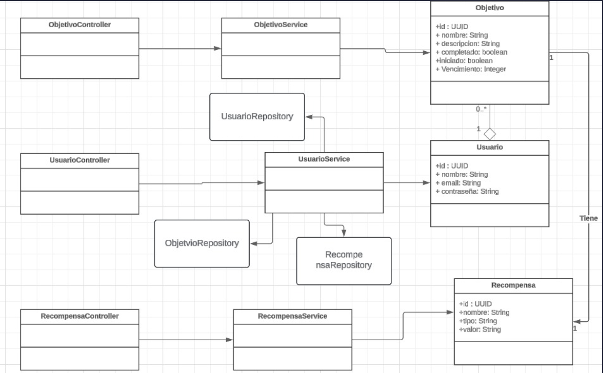
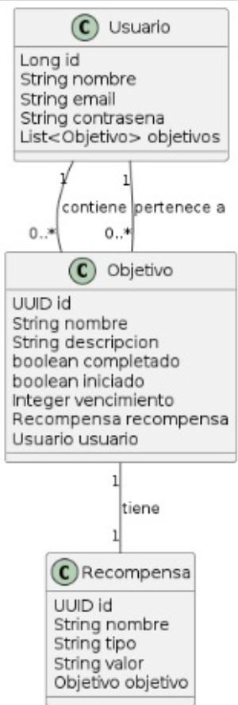
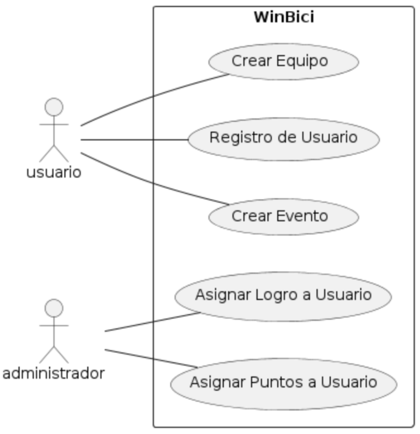

# 🟢 WinBici 🚲
### Elaborado por: Tatiana Vivas , Juan Pablo Cañón y Daniel Felipe León

## Indice:
- ### Descripción
- ### Diagrama de Clases
- ### Esquema Casos de Uso
- ### Casos de Uso

## Idea:
La propuesta de este proyecto es el lanzamiento de "WinBici", una plataforma digital que busca incentivar el uso de bicicletas ofreciendo recompensas y fomentando la participación en eventos y desafíos relacionados con el ciclismo. Este sistema está diseñado para enriquecer la experiencia ciclista, motivando tanto a propietarios como a quienes alquilan bicicletas a través de un enfoque gamificado que incluye logros, tareas diarias/semanales, y competiciones. "WinBici" se estructura en torno a tres módulos principales: Comunidad, Recompensas, y Tareas/Logros/Misiones, cada uno destinado a fomentar un mayor uso de bicicletas de manera divertida y comprometida, mientras se contribuye a la sostenibilidad y al bienestar personal.

## Diagrama de Clases:






## Esquema de Casos de Uso:

En el la siguiente imagen se encuentra el diagrama de los 5 casos de uso básicos para el funcionamiento de la parte inicial de WinBici



## Casos de Uso

# CU001: Registro de Usuario

---

**Descripción:** Cuando un nuevo usuario desea unirse a la plataforma WinBici, registra su nombre y su correo electrónico.

**Actor:** Usuario


## Flujo de Eventos (Guión)


| Actor  | Sistema |
|:-------|:---------|
| 1. Ingresa el nombre y el correo electrónico | |
| | 2. Verifica que el correo electrónico no este registrado previamente |
| | 3. Genera un ID único para el nuevo usuario |
| | 4. Almacena el nuevo usuario con su ID, nombre y correo electrónico |
| | 5. Retorna un mensaje de confirmación del registro |


## Excepciones

2. Cuando el correo electrónico ya está registrado

| Actor  | Sistema |
|:-------|:---------|
| | 2.1. Muestra un mensaje "El correo electrónico ya está registrado" |
| | 2.2. Termina | 

# CU002: Crear Equipo

---

**Descripción:** Cuando un usuario desea crear un nuevo equipo en la plataforma WinBici, registra el nombre del equipo y los miembros iniciales.

**Actor:** Usuario


## Flujo de Eventos (Guión)


| Actor  | Sistema |
|:-------|:---------|
| 1. Ingresa el nombre del equipo y los miembros iniciales | |
| | 2. Verifica que el nombre del equipo no esté registrado previamente |
| | 3. Genera un ID único para el nuevo usuario |
| | 4. Almacena el nuevo equipo con su ID, nombre y miembros iniciales |
| | 5. Retorna un mensaje de confirmación de la creación del equipo |


## Excepciones

2. Cuando el equipo ya está registrado

| Actor  | Sistema |
|:-------|:---------|
| | 2.1. Muestra un mensaje "El nombre del equipo ya está registrado" |
| | 2.2. Termina | 


# CU003: Crear Evento

---

**Descripción:** Cuando un usuario desea crear un nuevo evento en la plataforma WinBici, registra el nombre del evento y la fecha del mismo.

**Actor:** Usuario


## Flujo de Eventos (Guión)


| Actor  | Sistema |
|:-------|:---------|
| 1. Ingresa el nombre del evento y la fecha del mismo | |
| | 2. Verifica que el nombre del evento no esté registrado previamente |
| | 3. Genera un ID único para el nuevo evento |
| | 4. Almacena el nuevo equipo con su ID, nombre y fecha |
| | 5. Retorna un mensaje de confirmación de la creación del evento |


## Excepciones

2. Cuando el nombre del evento ya está registrado

| Actor  | Sistema |
|:-------|:---------|
| | 2.1. Muestra un mensaje "El nombre del evento ya está registrado" |
| | 2.2. Termina |


# CU004: Asignar Puntos a Usuario

---

**Descripción:** Cuando un administrador desea asignar puntos a un usuario en la plataforma WinBici, registra el ID del usuario y la cantidad de puntos a asignar.

**Actor:** Administrador


## Flujo de Eventos (Guión)


| Actor  | Sistema |
|:-------|:---------|
| 1. Ingresa el ID del usuario y la cantidad de puntos a asignar | |
| | 2. Verifica que el ID del usuario exista |
| | 3. Asigna la cantidad de puntos al usuario |
| | 4. Almacena la transacción de puntos |
| | 5. Retorna un mensaje de confirmación de la asignación de puntos |


## Excepciones

2. Cuando el ID del usuario no existe

| Actor  | Sistema |
|:-------|:---------|
| | 2.1. Muestra un mensaje "El ID del usuario no existe" |
| | 2.2. Termina |

# CU005: Asignar Logro a Usuario

---

**Descripción:** Cuando un administrador desea asignar un logro a un usuario en la plataforma WinBici, registra el ID del usuario y el ID del logro a asignar.

**Actor:** Administrador


## Flujo de Eventos (Guión)


| Actor  | Sistema |
|:-------|:---------|
| 1. Ingresa el ID del usuario y el ID del logro a asignar | |
| | 2. Verifica que el ID del usuario exista |
| | 3. Verifica que el ID del logro exista |
| | 4. Asigna el logro al usuario |
| | 5. Almacena la asignación del logro |
| | 6. Retorna un mensaje de confirmación de la asignación del logro |


## Excepciones

2. Cuando el ID del usuario no existe

| Actor  | Sistema |
|:-------|:---------|
| | 2.1. Muestra un mensaje "El ID del usuario no existe" |
| | 2.2. Termina |

3. Cuando el ID del logro no existe

| Actor  | Sistema |
|:-------|:---------|
| | 3.1. Muestra un mensaje "El ID del usuario no existe" |
| | 3.2. Termina |


  ```