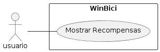

# CU003: Mostrar Recompensa

---

**Descripción:**  Cuando un usuario desea ver las recompensas disponibles en la plataforma WinBici, el sistema muestra una lista de recompensas.

**Actor:** Usuario


## Flujo de Eventos (Guión)


| Actor  | Sistema |
|:-------|:---------|
| 1. Solicita ver las recompensas disponibles | |
| | 2. Recupera la lista de recompensas disponibles |
| | 3. Muestra la lista de recompensas al usuario |


## Excepciones

2. Cuando no hay recompensas disponibles.

| Actor  | Sistema |
|| 2.1. Muestra un mensaje "No hay recompensas disponibles"|
|| 2.2 Termina |


## Diagrama 



```plantuml
@startuml "mostrar_recompensas"
left to right direction
skinparam packageStyle rectangle

actor usuario
rectangle WinBici {
  usuario -- (Mostrar Recompensas)
}

@enduml
