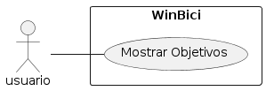

# CU004: Mostrar Objetivos

---

**Descripción:**  Cuando un usuario desea ver los objetivos en la plataforma WinBici, el sistema muestra una lista de objetivos cumplidos y por cumplir.

**Actor:** Usuario


## Flujo de Eventos (Guión)


| Actor  | Sistema |
|:-------|:---------|
| 1. Solicita ver los objetivos cumplidos y por cumplir | |
| | 2. Recupera la lista de objetivos cumplidos y por cumplir del usuario |
| | 3. Muestra la lista de objetivos al usuario|


## Excepciones

2. Cuando no hay objetivos disponibles

| Actor  | Sistema |
|:-------|:---------|
| | 2.1. Muestra un mensaje "No hay objetivos disponibles" |
| | 2.2. Termina | 


## Diagrama 



```plantuml
@startuml "mostrar_objetivos"
left to right direction
skinparam packageStyle rectangle

actor usuario
rectangle WinBici {
  usuario -- (Mostrar Objetivos)
}

@enduml
